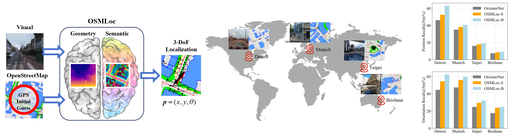

<h2> 
<a href="https://whu-usi3dv.github.io/OSMLoc/" target="_blank">OSMLoc: Single Image-Based Visual Localization in OpenStreetMap with Semantic and Geometric Guidances</a>
</h2>

This is the official PyTorch implementation of the following publication:

> **OSMLoc: Single Image-Based Visual Localization in OpenStreetMap with Semantic and Geometric Guidances**<br/>
> [Youqi Liao*](https://martin-liao.github.io/),[Xieyuanli Chen*](https://xieyuanli-chen.com/),[Shuhao Kang](https://kang-1-2-3.github.io/) [Jianping Li**](https://kafeiyin00.github.io/),  [Zhen Dong](https://dongzhenwhu.github.io/index.html), [Hongchao Fan](https://scholar.google.com/citations?user=VeH-I7AAAAAJ), [Bisheng Yang](https://3s.whu.edu.cn/info/1025/1415.htm)<br/>
> *Technical Report*<br/>
> **Paper** | [**Arxiv**](https://arxiv.org/abs/2411.08665) | [**Project-page**](https://whu-usi3dv.github.io/OSMLoc/) | [**Video**](https://youtu.be/b09mZ3AmNkA)


## 🔭 Introduction
<p align="center">
<strong>TL;DR: OSMLoc is an image-to-OpenstreetMap (I2O) visual localization framework with geometric and semantic guidance.</strong>
</p>


<p align="justify">
<strong>Abstract:</strong> OpenStreetMap (OSM), an online and versatile source of volunteered geographic information (VGI), is widely used for human self-localization by matching nearby visual observations with vectorized map data. However, due to the divergence in modalities and views, image-to-OSM (I2O) matching and localization remain challenging for robots, preventing the full utilization of VGI data in the unmanned ground vehicles and logistic industry. Inspired by the fact that the human brain relies on different regions when processing geometric and semantic information for spatial localization tasks, in this paper, we propose the OSMLoc. OSMLoc is a brain-inspired monocular visual localization method with semantic and geometric guidance to improve accuracy, robustness, and generalization ability. First, we equip the OSMLoc with the visual foundational model to extract powerful image features. Second, a geometry-guided depth distribution adapter is proposed to bridge the monocular depth estimation and camera-to-BEV transform. Thirdly, the semantic embeddings from the OSM data are utilized as auxiliary guidance for image-to-OSM feature matching. To validate the proposed OSMLoc, we collect a worldwide cross-area and cross-condition (CC) benchmark for extensive evaluation. Experiments on the MGL dataset, CC validation benchmark, and KITTI dataset have demonstrated the superiority of our method.
</p>

## 🆕 News
- 2024-11-20: [Project page](https://whu-usi3dv.github.io/OSMLoc/) (with introduction video) is available!🎉 
- 2024-11-20: The code, pre-trained models, and validation benchmark will be available upon acceptance of the paper.

## 💡 Citation
If you find this repo helpful, please give us a star~.Please consider citing OSMLoc if this program benefits your project.
```
@article{liao2024osmloc,
  title={OSMLoc: Single Image-Based Visual Localization in OpenStreetMap with Geometric and Semantic Guidances},
  author={Liao, Youqi and Chen, Xieyuanli and Kang, Shuhao and Li, Jianping and Dong, Zhen and Fan, Hongchao and Yang, Bisheng},
  journal={arXiv preprint arXiv:2411.08665},
  year={2024}
}
```

## 🔗 Related Projects
We sincerely thank the excellent projects:
- [OrienterNet](https://github.com/facebookresearch/OrienterNet) for pioneering I2O visual localization approach;
- [Retrieval](https://github.com/YujiaoShi/HighlyAccurate) for extensive evaluation;
- [Refine](https://github.com/tudelft-iv/CrossViewMetricLocalization) for extensive evaluation;
- [Range-MCL](https://github.com/PRBonn/range-mcl) for Monto Carlo localization framework;
- [Freereg](https://github.com/WHU-USI3DV/FreeReg) for excellent template; 